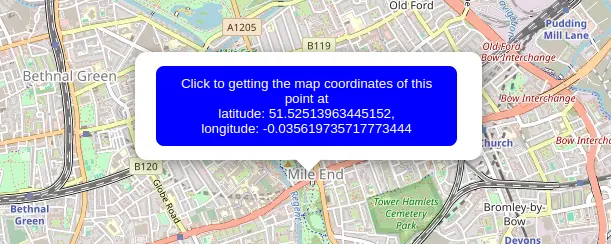

# A vanilla JavaScript Web Component for Leaflet maps

Behind this idea is learning about:
- Use the open-source JavaScript library [Leaflet](https://leafletjs.com/index.html) for playing with maps
- Web Components

Checkout the [demo](https://migupl.github.io/vanilla-js-web-component-leaflet-geojson/) 👀.

A more interesting example could be the integration with [dropping images](https://github.com/migupl/drop-photo-get-exif-data), as we can see [here](https://migupl.github.io/where-was-the-photo-taken/).

## GeoJSON

GeoJSON is a format for encoding a variety of geographic data structures.

A GeoJSON object may represent a region of space (a Geometry), a spatially bounded entity (a Feature), or a list of Features (a FeatureCollection).

GeoJSON supports the following geometry types: Point, LineString, Polygon, MultiPoint, MultiLineString, MultiPolygon, and GeometryCollection.

Features in GeoJSON contain a Geometry object and additional properties, and a FeatureCollection contains a list of Features. [GeoJSON Specification (RFC 7946)](https://tools.ietf.org/html/rfc7946)

## Web Components

Web Components[^1] use three separate technologies together:
- Custom Elements[^2]. Quite simply, these are fully-valid HTML elements with custom templates, behaviors and tag names (e.g. <leaflet-geojson-map>) made with a set of JavaScript APIs.
- Shadow DOM[^3]. Capable of isolating CSS and JavaScript. This is defined in the Living Standard DOM specification.
- HTML templates[^4]. User-defined templates in HTML that aren’t rendered until called upon.

### Custom elements

Custom elements are like the standard elements - <div>, <head> or <footer> - except they always have a dash[^5] in them.

Custom elements contain their own semantics, behaviors, markup and can be shared across frameworks and browsers.

A basic example,

```javascript
class SayHello extends HTMLElement {
    constructor() {
        super(); // Required

        const root = this.attachShadow({ mode: 'open' });
        root.innerHTML = `
        <style>
        h1 {
            color: blue;
            font-size: 4em;
        }
        </style>
        <h1>Hello world!!!</h1>
        `
}
    
customElements.define('say-hello', SayHello);
```

```html
<say-hello></say-hello>
```


The content of the generated HTML code will be as follows

```html
<say-hello>
    <!-- #shadow-root (open) -->
    <style>
    h1 {
        color: blue;
        font-size: 4em;
    }
    </style>
    <h1>Hello world!!!</h1>
</say-hello>
```

All custom elements must in some way extend an HTMLElement in order to be registered with the browser.

The mode option[^6] in attachShadow specifies the *encaptulation mode* for the shadow DOM tree. See further, [Element.attachShadow()](https://developer.mozilla.org/en-US/docs/Web/API/Element/attachShadow)

### Shadow DOM

The shadow DOM is an encapsulated version of the DOM that is inaccessible from it and defines its own behavior and style.

### Template element

The HTML &lt;template&gt; element allows us to define a re-usable templates of code that won’t be rendered, but can be used at a later time.

## Install

## Getting started

You can self-hosted by copying the `components/leaflet-geojson-map.min.js` file

```html
<body>
    <leaflet-geojson-map></leaflet-geojson-map>
    <script src="/path/to/leaflet-geojson-map.min.js"></script>
</body>
```

## Tiles

Change easily the tile layer on the map using the *tile-server* property.

Note that most tile servers require attribution, which you can set using the *tileCopyrigth* property.

```html
<body>
    <leaflet-geojson-map
        longitude="-3.7001448634709626"
        latitude="40.4237577382345"
        zoom="13"
        tile-copyright="Map data: &copy; <a href='https://www.openstreetmap.org/copyright'>OpenStreetMap</a> contributors, <a href='http://viewfinderpanoramas.org'>SRTM</a> | Map style: &copy; <a href='https://opentopomap.org'>OpenTopoMap</a> (<a href='https://creativecommons.org/licenses/by-sa/3.0/'>CC-BY-SA</a>)"
        tile-server="https://{s}.tile.opentopomap.org/{z}/{x}/{y}.png">
    </leaflet-geojson-map>
</body>
```

[Leaflet Provider Demo](http://leaflet-extras.github.io/leaflet-providers/preview/index.html) is a good resource for Leaflet layer providers

## Attributes and default values

The Web Component *leaflet-geojson-map* allows the following attributes: *latitude*; *longitude*; *max-zoom*; *tile-copyright*; *tile-server*; *zoom*; and, the specials *allows-add-marker*, *add-marker-custom-text*, *custom-style* and *fit-to-bounds* or *fly-to-bounds*.

All attributes are optional.

Default values are

```javascript
{
    latitude: 51.505,
    longitude: -0.09,
    max-zoom: 19,
    tile-copyright: '&copy; <a href="http://www.openstreetmap.org/copyright">OpenStreetMap</a>',
    tile-server: 'https://tile.openstreetmap.org/{z}/{x}/{y}.png',
    zoom: 13
}
```

The optional attribute *allows-add-marker* triggers the 'x-leaflet-map:marker-pointed-out' event on [adding a new marker](#adding-a-marker-to-the-map). **Nothing is added to the map**.

You can set a custom text for the confirm action using the attribute *add-marker-custom-text*, otherwise the default value is 'Click to getting the map coordinates of this point at'. Latitude and longitude are always added.

The optional attribute *custom-style* defines the name of the custom class and style file separated by a colon. This allows custom styling of elements within the Web Component.

The special attributes *fit-to-bounds* or *fly-to-bounds*, without or with animation, the map view to contain all added GeoJSON objects at the hightst possible zoom level.

### The *custom-style* attribute

For example, to change the background colour of all pop-up, we would include a CSS file

custom-popup-style.css
```css
.custom-leaflet-popup-style .leaflet-popup-content-wrapper {
    background: #2c3e50;
    color: #fff;
}

.custom-leaflet-popup-style .leaflet-popup-tip {
    background: #2c3e50;
}
```

and the *custom-style* attribute as following

```html
<body>
    <leaflet-geojson-map custom-style="custom-leaflet-popup-style:<path to file>/custom-popup-style.css"></leaflet-geojson-map>
</body>
```

Obviously the name of the class '*custom-leaflet-popup-style*' is the same as the one that encapsulates the styles in the css file.

Check this on the [demo start map](https://migupl.github.io/vanilla-js-web-component-leaflet-geojson/#initial-map) and click on the point to get a pop-up window with a dark background.

## Events

The Web Component *leaflet-geojson-map* defines two events as actions.

### Event 'x-leaflet-map-geojson-add'

Use it to adding GeoJSON [Features](https://tools.ietf.org/html/rfc7946#section-3.2) and [FeatureCollections](https://tools.ietf.org/html/rfc7946#section-3.3) as they allow you to describe features with a set of properties (samples bellow).

This event requires an object with the property:
- geojson, the GeoJSON object to be added

### Event 'x-leaflet-map-clear'

Use it to removing all GeoJSON features from the map (see [Clear a map](#clear-a-map)).

This event requires no object.

## Adding [GeoJSON objects](https://www.rfc-editor.org/rfc/rfc7946#section-3)

The *style* and *popupContent* properties are optional.

The *coordinates* property is an array of numbers. There MUST be two or three elements. The first two elements are longitude and latitude, or easting and northing, precisely in that order and using decimal numbers. Altitude or elevation MAY be included as an optional third element.

The *icon* property for a marker is optional.

### Point

#### Adding a marker

```html
<body>
    <leaflet-geojson-map></leaflet-geojson-map>

    <script>
        setTimeout(function () {
            const map = document.querySelector('leaflet-geojson-map');

            const marker = {
                type: "Feature",
                geometry: {
                    type: "Point",
                    coordinates: [-0.09, 51.5]
                },
                properties: {
                    popupContent: "<b>Hello world!</b><br>I am a popupContent.",
                    icon: {
                        iconUrl: 'https://raw.githubusercontent.com/pointhi/leaflet-color-markers/master/img/marker-icon-green.png',
                        shadowUrl: 'https://cdnjs.cloudflare.com/ajax/libs/leaflet/0.7.7/images/marker-shadow.png',
                        iconSize: [25, 41],
                        iconAnchor: [12, 41],
                        popupAnchor: [1, -34],
                        shadowSize: [41, 41]
                    }
                }
            }

            map.dispatchEvent(new CustomEvent('x-leaflet-map-geojson-add', {
                detail: {
                    geojson: marker
                }
            }));
        }, 1000);
    </script>
</body>
```

A marker allows to be dragged by adding the draggable property in as follow

```javascript
const marker = {
    type: "Feature",
    geometry: {
        type: "Point",
        coordinates: [-0.09, 51.5]
    },
    properties: {
        ...,
        draggable: true
        }
    ...
}
```

#### Adding a circle

The **radius** property defines a circle and is the only one required.

```html
<body>
    <leaflet-geojson-map></leaflet-geojson-map>

    <script>
        setTimeout(function () {
            const map = document.querySelector('leaflet-geojson-map');

            const circle = {
                type: "Feature",
                geometry: {
                    type: "Point",
                    coordinates: [-0.11, 51.508]
                },
                properties: {
                    radius: 40,
                    popupContent: "I am a circle.",
                    style: {
                        color: 'red',
                        fillColor: '#f03',
                        fillOpacity: 0.5,
                    }
                }
            }

            map.dispatchEvent(new CustomEvent('x-leaflet-map-geojson-add', {
                detail: {
                    geojson: circle
                }
            }));
        }, 1000);
    </script>
</body>
```

### MultiPoint

```html
<body>
    <leaflet-geojson-map></leaflet-geojson-map>

    <script>
        setTimeout(function () {
            const map = document.querySelector('leaflet-geojson-map');

            const multiPoint = {
                type: "Feature",
                geometry: {
                    type: "MultiPoint",
                    coordinates: [
                        [-0.14082945900490862, 51.500729712288845],
                        [-0.126152411319017, 51.518999110271444],
                        [-0.09791411489411447, 51.513123787337804]
                    ]
                },
                properties: {
                    popupContent: "I am a MultiPoint.",
                    icon: {
                        iconUrl: 'https://raw.githubusercontent.com/pointhi/leaflet-color-markers/master/img/marker-icon-black.png',
                        shadowUrl: 'https://cdnjs.cloudflare.com/ajax/libs/leaflet/0.7.7/images/marker-shadow.png',
                        iconSize: [25, 41],
                        iconAnchor: [12, 41],
                        popupAnchor: [1, -34],
                        shadowSize: [41, 41]
                    }
                }
            };

            map.dispatchEvent(new CustomEvent('x-leaflet-map-geojson-add', {
                detail: {
                    geojson: multiPoint
                }
            }));
        }, 1000);
    </script>
</body>
```

### LineString

```html
<body>
    <leaflet-geojson-map></leaflet-geojson-map>

    <script>
        setTimeout(function () {
            const map = document.querySelector('leaflet-geojson-map');

            const lineString = {
                type: "Feature",
                geometry: {
                    type: "LineString",
                    coordinates: [
                        [-0.14082945900490862, 51.500729712288845],
                        [-0.126152411319017, 51.518999110271444],
                        [-0.09791411489411447, 51.513123787337804]
                    ]
                },
                properties: {
                    popupContent: "I am a LineString.",
                    style: {
                        color: "black",
                        opacity: 1,
                    }
                }
            };

            map.dispatchEvent(new CustomEvent('x-leaflet-map-geojson-add', {
                detail: {
                    geojson: lineString
                }
            }));
        }, 1000);
    </script>
</body>
```

### MultiLineString

```html
<body>
    <leaflet-geojson-map></leaflet-geojson-map>

    <script>
        setTimeout(function () {
            const map = document.querySelector('leaflet-geojson-map');

            const multiLineString = {
                type: "Feature",
                geometry: {
                    type: "MultiLineString",
                    coordinates: [
                        [
                            [-0.12452174238299801, 51.50066274018154],
                            [-0.11752654129293857, 51.50076292147487]
                        ],
                        [
                            [-0.11752654129293857, 51.50076292147487],
                            [-0.11614252143672825, 51.50273310885865]
                        ],
                        [
                            [-0.11614252143672825, 51.50273310885865],
                            [-0.11935044340901013, 51.50326738227206]
                        ],
                    ]
                },
                properties: {
                    popupContent: "I am a MultiLineString.",
                    style: {
                        color: "green",
                        opacity: 1,
                    }
                }
            };

            map.dispatchEvent(new CustomEvent('x-leaflet-map-geojson-add', {
                detail: {
                    geojson: multiLineString
                }
            }));
        }, 1000);
    </script>
</body>
```

### Polygon

The property *popupContent* is optional.

```html
<body>
    <leaflet-geojson-map></leaflet-geojson-map>

    <script>
        setTimeout(function () {
            const map = document.querySelector('leaflet-geojson-map');

            const polygon = {
                type: "Feature",
                geometry: {
                    type: "Polygon",
                    coordinates: [[
                        [-0.08, 51.509],
                        [-0.06, 51.503],
                        [-0.047, 51.51]
                    ]]
                },
                properties: {
                    popupContent: "I am a polygon.",
                    style: {
                        color: "magenta",
                        opacity: 1,
                    }
                }
            };

            map.dispatchEvent(new CustomEvent('x-leaflet-map-geojson-add', {
                detail: {
                    geojson: polygon
                }
            }));
        }, 1000);
    </script>
</body>
```

### MultiPolygon

```html
<body>
    <leaflet-geojson-map></leaflet-geojson-map>

    <script>
        setTimeout(function () {
            const map = document.querySelector('leaflet-geojson-map');

            const multiPolygon = {
                type: "Feature",
                geometry: {
                    type: "MultiPolygon",
                    coordinates: [
                        [
                            [
                                [-0.09365488101163101, 51.509838432977276],
                                [-0.09341884661902165, 51.5097449490648],
                                [-0.0944273572056253, 51.50808891653398],
                                [-0.09470630694234546, 51.508142337877736]
                            ],
                        ],
                        [
                            [
                                [-0.08751798680378747, 51.508930295422665],
                                [-0.08723903706706732, 51.50887687500278],
                                [-0.0879685979169508, 51.506926986810356],
                                [-0.08820463230956016, 51.506940342492776]
                            ]
                        ]
                    ]
                },
                properties: {
                    popupContent: "I am a MultiPolygon.",
                    style: {
                        color: "red",
                        opacity: 1,
                    }
                }
            };

            map.dispatchEvent(new CustomEvent('x-leaflet-map-geojson-add', {
                detail: {
                    geojson: multiPolygon
                }
            }));
        }, 1000);
    </script>
</body>
```

### FeatureCollections

```html
<body>
    <leaflet-geojson-map></leaflet-geojson-map>

    <script>
        setTimeout(function () {
            const map = document.querySelector('leaflet-geojson-map');

            const features = {
                type: "FeatureCollection",
                features: [{
                    type: "Feature",
                    geometry: {
                        type: "Point",
                        coordinates: [-0.09, 51.5]
                    },
                    properties: {
                        popupContent: "<b>Hello world!</b><br>I am a popup."
                    }
                },
                {
                    type: "Feature",
                    geometry: {
                        type: "Point",
                        coordinates: [-0.11, 51.508]
                    },
                    properties: {
                    radius: 500,
                    popupContent: "I am a circle.",
                    style: {
                        color: 'red',
                        fillColor: '#f03',
                        fillOpacity: 0.5,
                    }
                    }
                },
                {
                    type: "Feature",
                    geometry: {
                        type: "Polygon",
                        coordinates: [[
                            [-0.08, 51.509],
                            [-0.06, 51.503],
                            [-0.047, 51.51]
                        ]]
                    },
                    properties: {
                        popupContent: "I am a polygon."
                    }
                }]
            };

            map.dispatchEvent(new CustomEvent('x-leaflet-map-geojson-add', {
                detail: {
                    geojson: features
                }
            }));
        }, 1000);
    </script>
</body>
```

## Multiple maps

```html
<body>
    <leaflet-geojson-map id="first-map"></leaflet-geojson-map>
    <leaflet-geojson-map id="second-map"></leaflet-geojson-map>

    <script>
        setTimeout(function () {
            const firstMap = document.getElementById('first-map');
            const secondMap = document.getElementById('second-map');

            const point = {
                type: "Feature",
                geometry: {
                    type: "Point",
                    coordinates: [-0.09, 51.5]
                },
                properties: {
                    popupContent: "<b>Hello world!</b><br>I am a popup.",
                    icon: {
                        iconUrl: 'https://raw.githubusercontent.com/pointhi/leaflet-color-markers/master/img/marker-icon-green.png',
                        shadowUrl: 'https://cdnjs.cloudflare.com/ajax/libs/leaflet/0.7.7/images/marker-shadow.png',
                        iconSize: [25, 41],
                        iconAnchor: [12, 41],
                        popupAnchor: [1, -34],
                        shadowSize: [41, 41]
                    }
                }
            };

            const circle = {
                type: "Feature",
                geometry: {
                    type: "Point",
                    coordinates: [-0.11, 51.508]
                },
                properties: {
                    radius: 40,
                    popupContent: "I am a circle.",
                    style: {
                        color: 'red',
                        fillColor: '#f03',
                        fillOpacity: 0.5,
                    }
                }
            };

            firstMap.dispatchEvent(new CustomEvent('x-leaflet-map-geojson-add', {
                detail: {
                    geojson: point
                }
            }));

            secondMap.dispatchEvent(new CustomEvent('x-leaflet-map-geojson-add', {
                detail: {
                    geojson: circle
                }
            }));
        }, 1000);
    </script>
</body>
```

## Adding a marker to the map

Actually adding a marker only triggers the 'x-leaflet-map:marker-pointed-out' event and any action must be performed by whoever uses the web component by adding functionality to that marker. Nothing is done on the map.

Adding a marker to the map could be done clicking with the right button in any point.

This action opens a popup with a button for confirmation as follows



Clicking in it triggers the 'x-leaflet-map:marker-pointed-out' event by exposing the latitude and longitude of the point as follows

```
x-leaflet-map:marker-pointed-out {
    target: leaflet-geojson-map,
    isTrusted: false,
    detail: {
        latlng: {
            lat: 51.52540664057756,
            lng: -0.07201194763183595
        }
    }
    ...
}
```

You can use the file *[example.html](example.html)* of the project as a small demo using the *allows-add-marker* attribute.

## Remove a marker from the map

Any of the markers added to the map can be deleted by double clicking on it and confirming the deletion.

Web Component *leaflet-geojson-map* triggers the 'x-leaflet-map:marker-removed' event when any marker is removed from map by exposing its GeoJSON as follows

```
x-leaflet-map:marker-removed {
    target: leaflet-geojson-map,
    isTrusted: false,
    detail: {
        feature: {
            type: "Feature",
            geometry: {
                type: "Point",
                coordinates: [-0.09, 51.5]
            },
            ...
        }
    }
    ...
}
```

You can use the file *[example.html](example.html)* of the project as a small demo using the *fly-to-bounds* attribute.

## Clear a map

```html
<body>
    <leaflet-geojson-map id="first-map"></leaflet-geojson-map>
    <leaflet-geojson-map id="second-map"></leaflet-geojson-map>

    <script>
        const map = document.querySelector('leaflet-geojson-map');

        setTimeout(function () {
            const point = {
                type: "Feature",
                geometry: {
                    type: "Point",
                    coordinates: [-0.09, 51.5]
                },
                properties: {
                    popupContent: "<b>Hello world!</b><br>I am a popup.",
                    icon: {
                        iconUrl: 'https://raw.githubusercontent.com/pointhi/leaflet-color-markers/master/img/marker-icon-green.png',
                        shadowUrl: 'https://cdnjs.cloudflare.com/ajax/libs/leaflet/0.7.7/images/marker-shadow.png',
                        iconSize: [25, 41],
                        iconAnchor: [12, 41],
                        popupAnchor: [1, -34],
                        shadowSize: [41, 41]
                    }
                }
            };

            map.dispatchEvent(new CustomEvent('x-leaflet-map-geojson-add', {
                detail: {
                    geojson: point
                }
            }));
        }, 1000);

        setTimeout(function () {
            map.dispatchEvent(new Event('x-leaflet-map-geojson-clear'));
        }, 3000);
    </script>
</body>
```

## An example

Using a *point* feature with a small card.

```html
<!DOCTYPE html>
<html lang="en">
<head>
    <meta http-equiv="content-type" content="text/html; charset=UTF-8">
    <meta charset="utf-8">
    <meta name="viewport" content="width=device-width, initial-scale=1">

    <title>Web Component - Leaflet Map</title>

    <link rel="shortcut icon" type="image/x-icon" href="assets/favicon.ico">
    <style>
        html,
        body {
            height: 100%;
            margin: 0;
        }

        leaflet-geojson-map {
            height: 500px;
            width: 800px;
            display: inline-block;
            position: relative;
            outline: none;
        }

        .card {
            box-shadow: 0 4px 8px 0 rgba(0, 0, 0, 0.2);
            transition: 0.3s;
            border-radius: 5px;
        }

        .container {
            padding: 2px 16px;
        }

        img {
            border-radius: 5px 5px 0 0;
        }
    </style>
</head>

<body>
    <leaflet-geojson-map></leaflet-geojson-map>

    <script>
        setTimeout(function () {
            const map = document.querySelector('leaflet-geojson-map');

            const burgessPark = {
                type: "Feature",
                geometry: {
                    type: "Point",
                    coordinates: [-0.08144411512541307, 51.48288683515307]
                },
                properties: {
                    popupContent: `
<div class="card">
    
    <div class="container">
        <h4><strong>Burgess Park</strong></h4>
        <p>
            At 56 hectares, Burgess Park is Southwark's largest park.
            The park stretches from Camberwell and Walworth in the west to Peckham and the Old Kent Road in the east.</p>
    </div>
</div >
`,
                    icon: {
                        iconUrl: 'https://raw.githubusercontent.com/pointhi/leaflet-color-markers/master/img/marker-icon-green.png',
                        shadowUrl: 'https://cdnjs.cloudflare.com/ajax/libs/leaflet/0.7.7/images/marker-shadow.png',
                        iconSize: [25, 41],
                        iconAnchor: [12, 41],
                        popupAnchor: [1, -34],
                        shadowSize: [41, 41]
                    }
                }
            };

            map.dispatchEvent(new CustomEvent('x-leaflet-map-geojson-add', {
                detail: {
                    geojson: burgessPark
                }
            }));
        }, 1000);
    </script>
    <script src="/path/to/leaflet-geojson-map.min.js"></script>
</body>
</html>
```


You have another example with all the features and the *fly-to-bounds* attribute in [example.html](example.html).

## Helpers

A [container is used for hot reloading](https://github.com/migupl/hot-reloading-container) during development.

Test your GeoJSON with [GeoJSONLint](https://geojsonlint.com/).

[Leaflet color markers](https://github.com/pointhi/leaflet-color-markers)

[Leaflet.markercluster](https://github.com/Leaflet/Leaflet.markercluster#leafletmarkercluster) is used.

Web Component behind this idea are:
- [Yet Another GitHub Corner](https://github.com/migupl/yagc)

Good luck and I hope you enjoy it.

## License

[MIT license](http://www.opensource.org/licenses/mit-license.php)

[^1]: [An introduction to Web Components](https://css-tricks.com/an-introduction-to-web-components/)
[^2]: [HTML Living Standard specification](https://html.spec.whatwg.org/multipage/custom-elements.html#custom-elements)
[^3]: [Living Standard DOM specification](https://dom.spec.whatwg.org/#shadow-trees)
[^4]: The [<template> tag specification](https://html.spec.whatwg.org/multipage/scripting.html#the-template-element)
[^5]: [Valid custom element name](https://html.spec.whatwg.org/multipage/custom-elements.html#valid-custom-element-name)
[^6]: [Associated mode](https://dom.spec.whatwg.org/#shadowroot-mode) to shadow root