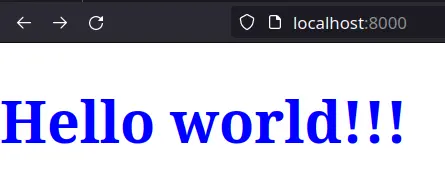
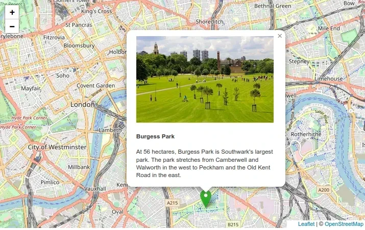

# A vanilla JavaScript Web Component for Leaflet maps

Behind this idea is learning about:
- Use the open-source JavaScript library [Leaflet](https://leafletjs.com/index.html) for playing with maps
- Web Components

## About

### GeoJSON

GeoJSON is a format for encoding a variety of geographic data structures […]. A GeoJSON object may represent a region of space (a Geometry), a spatially bounded entity (a Feature), or a list of Features (a FeatureCollection). GeoJSON supports the following geometry types: Point, LineString, Polygon, MultiPoint, MultiLineString, MultiPolygon, and GeometryCollection. Features in GeoJSON contain a Geometry object and additional properties, and a FeatureCollection contains a list of Features. [GeoJSON Specification (RFC 7946)](https://tools.ietf.org/html/rfc7946)

### Web Components

Web Components[^1] use three separate technologies together:
- Custom Elements[^2]. Quite simply, these are fully-valid HTML elements with custom templates, behaviors and tag names (e.g. <leaflet-map>) made with a set of JavaScript APIs.
- Shadow DOM[^3]. Capable of isolating CSS and JavaScript. This is defined in the Living Standard DOM specification.
- HTML templates[^4]. User-defined templates in HTML that aren’t rendered until called upon.

#### Custom elements

Custom elements are like the standard elements - <div>, <head> or <footer> - except they always have a dash[^5] in them.

Custom elements contain their own semantics, behaviors, markup and can be shared across frameworks and browsers.

A basic example,

```javascript
class SayHello extends HTMLElement {
    constructor() {
        super(); // Required

        const root = this.attachShadow({ mode: 'open' });
        root.innerHTML = `
        <style>
        h1 {
            color: blue;
            font-size: 4em;
        }
        </style>
        <h1>Hello world!!!</h1>
        `
}
    
customElements.define('say-hello', SayHello);
```

```html
<say-hello></say-hello>
```



The content of the generated HTML code will be as follows

```html
<say-hello>
    <!-- #shadow-root (open) -->
    <style>
    h1 {
        color: blue;
        font-size: 4em;
    }
    </style>
    <h1>Hello world!!!</h1>
</say-hello>
```

All custom elements must in some way extend an HTMLElement in order to be registered with the browser.

The mode option[^6] in attachShadow specifies the *encaptulation mode* for the shadow DOM tree. See further, [Element.attachShadow()](https://developer.mozilla.org/en-US/docs/Web/API/Element/attachShadow)

#### Shadow DOM

The shadow DOM is an encapsulated version of the DOM that is inaccessible from it and defines its own behavior and style.

#### Template element

The HTML &lt;template&gt; element allows us to define a re-usable templates of code that won’t be rendered, but can be used at a later time.

## Install

Copy the directory */components/leaflet-map-component/* to your project

## Getting started

To get started you need to import the Web Component

```html
<head>
    <script type="module" src="./components/leaflet-map-component/leaflet-map.js"></script>
</head>
<body>
	<leaflet-map
		longitude="-3.7001448634709626"
		latitude="40.4237577382345"
        maxZoom="20"
		zoom="13">
	</leaflet-map>
</body>
```

The Web Component *leaflet-map* exposes an event bus[^7] at the property *eventBus*.

## Tiles

Change easily the tile layer on the map using the *tileServer* property.

Note that most tile servers require attribution, which you can set using the *tileCopyrigth* property.

```html
<body>
	<leaflet-map
		longitude="-3.7001448634709626"
		latitude="40.4237577382345"
		zoom="13"
		tileCopyright="Map data: &copy; <a href='https://www.openstreetmap.org/copyright'>OpenStreetMap</a> contributors, <a href='http://viewfinderpanoramas.org'>SRTM</a> | Map style: &copy; <a href='https://opentopomap.org'>OpenTopoMap</a> (<a href='https://creativecommons.org/licenses/by-sa/3.0/'>CC-BY-SA</a>)"
		tileServer="https://{s}.tile.opentopomap.org/{z}/{x}/{y}.png">
	</leaflet-map>
</body>
```

[Leaflet Provider Demo](http://leaflet-extras.github.io/leaflet-providers/preview/index.html) is a good resource for Leaflet layer providers

## Default values

All parameters are optional.

Default values are

```javascript
{
    latitude: 51.505,
    longitude: -0.09,
    maxZoom: 19,
    tileCopyright: '&copy; <a href="http://www.openstreetmap.org/copyright">OpenStreetMap</a>',
    tileServer: 'https://tile.openstreetmap.org/{z}/{x}/{y}.png',
    zoom: 13
}
```

## Events

Leaflet-map Web Components defines two events:
- '**x-leaflet-map-geojson-add**' for adding GeoJSON [Features](https://tools.ietf.org/html/rfc7946#section-3.2) and [FeatureCollections](https://tools.ietf.org/html/rfc7946#section-3.3) as they allow you to describe features with a set of properties.
- '**x-leaflet-map-clear**' for removing all GeoJSON features from the map

## Adding [GeoJSON objects](https://www.rfc-editor.org/rfc/rfc7946#section-3)

The *style* and *popupContent* properties are optional.

The *coordinates* property is in the form *[longitude, latitude]*.

### Point

#### Adding a marker

```html
<body>
	<leaflet-map></leaflet-map>

    <script>
		setTimeout(function () {
			const map = document.querySelector('leaflet-map');
			const eventBus = map.eventBus;

			const marker = {
				type: "Feature",
				geometry: {
					type: "Point",
					coordinates: [-0.09, 51.5]
				},
				properties: {
					popupContent: "<b>Hello world!</b><br>I am a popupContent.",
					icon: {
						iconUrl: 'https://raw.githubusercontent.com/pointhi/leaflet-color-markers/master/img/marker-icon-green.png',
						shadowUrl: 'https://cdnjs.cloudflare.com/ajax/libs/leaflet/0.7.7/images/marker-shadow.png',
						iconSize: [25, 41],
						iconAnchor: [12, 41],
						popupAnchor: [1, -34],
						shadowSize: [41, 41]
					}
				}
			}

			eventBus.fire('x-leaflet-map-geojson-add', { leafletMap: map, geojson: marker });
		}, 1000);
	</script>
</body>
```

#### Adding a circle

The **radius** property defines a circle and is the only one required.

```html
<body>
	<leaflet-map></leaflet-map>

    <script>
		setTimeout(function () {
			const map = document.querySelector('leaflet-map');
			const eventBus = map.eventBus;

			const circle = {
				type: "Feature",
				geometry: {
					type: "Point",
					coordinates: [-0.11, 51.508]
				},
				properties: {
					radius: 40,
					popupContent: "I am a circle.",
					style: {
						color: 'red',
						fillColor: '#f03',
						fillOpacity: 0.5,
					}
				}
			}

			eventBus.fire('x-leaflet-map-geojson-add', { leafletMap: map, geojson: circle });
		}, 1000);
	</script>
</body>
```

### MultiPoint

```html
<body>
	<leaflet-map></leaflet-map>

    <script>
		setTimeout(function () {
			const map = document.querySelector('leaflet-map');
			const eventBus = map.eventBus;

			const multiPoint = {
				type: "Feature",
				geometry: {
					type: "MultiPoint",
					coordinates: [
						[-0.14082945900490862, 51.500729712288845],
						[-0.126152411319017, 51.518999110271444],
						[-0.09791411489411447, 51.513123787337804]
					]
				},
				properties: {
					popupContent: "I am a MultiPoint.",
					icon: {
						iconUrl: 'https://raw.githubusercontent.com/pointhi/leaflet-color-markers/master/img/marker-icon-black.png',
						shadowUrl: 'https://cdnjs.cloudflare.com/ajax/libs/leaflet/0.7.7/images/marker-shadow.png',
						iconSize: [25, 41],
						iconAnchor: [12, 41],
						popupAnchor: [1, -34],
						shadowSize: [41, 41]
					}
				}
			};

			eventBus.fire('x-leaflet-map-geojson-add', { leafletMap: map, geojson: multiPoint });
		}, 1000);
	</script>
</body>
```

### LineString

```html
<body>
	<leaflet-map></leaflet-map>

    <script>
		setTimeout(function () {
			const map = document.querySelector('leaflet-map');
			const eventBus = map.eventBus;

			const lineString = {
				type: "Feature",
				geometry: {
					type: "LineString",
					coordinates: [
						[-0.14082945900490862, 51.500729712288845],
						[-0.126152411319017, 51.518999110271444],
						[-0.09791411489411447, 51.513123787337804]
					]
				},
				properties: {
					popupContent: "I am a LineString.",
					style: {
						color: "black",
						opacity: 1,
					}
				}
			};

			eventBus.fire('x-leaflet-map-geojson-add', { leafletMap: map, geojson: lineString });
		}, 1000);
	</script>
</body>
```

### MultiLineString

```html
<body>
	<leaflet-map></leaflet-map>

    <script>
		setTimeout(function () {
			const map = document.querySelector('leaflet-map');
			const eventBus = map.eventBus;

			const multiLineString = {
				type: "Feature",
				geometry: {
					type: "MultiLineString",
					coordinates: [
						[
							[-0.12452174238299801, 51.50066274018154],
							[-0.11752654129293857, 51.50076292147487]
						],
						[
							[-0.11752654129293857, 51.50076292147487],
							[-0.11614252143672825, 51.50273310885865]
						],
						[
							[-0.11614252143672825, 51.50273310885865],
							[-0.11935044340901013, 51.50326738227206]
						],
					]
				},
				properties: {
					popupContent: "I am a MultiLineString.",
					style: {
						color: "green",
						opacity: 1,
					}
				}
			};

			eventBus.fire('x-leaflet-map-geojson-add', { leafletMap: map, geojson: multiLineString });
		}, 1000);
	</script>
</body>
```

### Polygon

The property *popupContent* is optional.

```html
<body>
	<leaflet-map></leaflet-map>

    <script>
		setTimeout(function () {
			const map = document.querySelector('leaflet-map');
			const eventBus = map.eventBus;

			const polygon = {
				type: "Feature",
				geometry: {
					type: "Polygon",
					coordinates: [[
						[-0.08, 51.509],
						[-0.06, 51.503],
						[-0.047, 51.51]
					]]
				},
				properties: {
					popupContent: "I am a polygon.",
					style: {
						color: "magenta",
						opacity: 1,
					}
				}
			};

			eventBus.fire('x-leaflet-map-geojson-add', { leafletMap: map, geojson: polygon });
		}, 1000);
	</script>
</body>
```

### MultiPolygon

```html
<body>
	<leaflet-map></leaflet-map>

    <script>
		setTimeout(function () {
			const map = document.querySelector('leaflet-map');
			const eventBus = map.eventBus;

			const multiPolygon = {
				type: "Feature",
				geometry: {
					type: "MultiPolygon",
					coordinates: [
						[
							[
								[-0.09365488101163101, 51.509838432977276],
								[-0.09341884661902165, 51.5097449490648],
								[-0.0944273572056253, 51.50808891653398],
								[-0.09470630694234546, 51.508142337877736]
							],
						],
						[
							[
								[-0.08751798680378747, 51.508930295422665],
								[-0.08723903706706732, 51.50887687500278],
								[-0.0879685979169508, 51.506926986810356],
								[-0.08820463230956016, 51.506940342492776]
							]
						]
					]
				},
				properties: {
					popupContent: "I am a MultiPolygon.",
					style: {
						color: "red",
						opacity: 1,
					}
				}
			};

			eventBus.fire('x-leaflet-map-geojson-add', { leafletMap: map, geojson: multiPolygon });
		}, 1000);
	</script>
</body>
```

### FeatureCollections

```html
<body>
	<leaflet-map></leaflet-map>

    <script>
		setTimeout(function () {
			const map = document.querySelector('leaflet-map');
			const eventBus = map.eventBus;

			const features = {
				type: "FeatureCollection",
				features: [{
					type: "Feature",
					geometry: {
						type: "Point",
						coordinates: [-0.09, 51.5]
					},
					properties: {
						popupContent: "<b>Hello world!</b><br>I am a popup."
					}
				},
				{
					type: "Feature",
					geometry: {
						type: "Point",
						coordinates: [-0.11, 51.508]
					},
					properties: {
						color: 'red',
						fillColor: '#f03',
						fillOpacity: 0.5,
						radius: 40,
						popupContent: "I am a circle."
					}
				},
				{
					type: "Feature",
					geometry: {
						type: "Polygon",
						coordinates: [[
							[-0.08, 51.509],
							[-0.06, 51.503],
							[-0.047, 51.51]
						]]
					},
					properties: {
						popupContent: "I am a polygon."
					}
				}]
			};

			eventBus.fire('x-leaflet-map-geojson-add', {
				leafletMap: map,
				geojson: features
			});
		}, 1000);
	</script>
</body>
```

## Multiple maps

```html
<body>
	<leaflet-map id="first-map"></leaflet-map>
	<leaflet-map id="second-map"></leaflet-map>

    <script>
		setTimeout(function () {
			const eventBus = document.querySelector('leaflet-map').eventBus;

			const firstMap = document.getElementById('first-map');
			const secondMap = document.getElementById('second-map');

			const point = {
				type: "Feature",
				geometry: {
					type: "Point",
					coordinates: [-0.09, 51.5]
				},
				properties: {
					popupContent: "<b>Hello world!</b><br>I am a popup.",
					icon: {
						iconUrl: 'https://raw.githubusercontent.com/pointhi/leaflet-color-markers/master/img/marker-icon-green.png',
						shadowUrl: 'https://cdnjs.cloudflare.com/ajax/libs/leaflet/0.7.7/images/marker-shadow.png',
						iconSize: [25, 41],
						iconAnchor: [12, 41],
						popupAnchor: [1, -34],
						shadowSize: [41, 41]
					}
				}
			};
			const circle = {
				type: "Feature",
				geometry: {
					type: "Point",
					coordinates: [-0.11, 51.508]
				},
				properties: {
					radius: 40,
					popupContent: "I am a circle.",
					style: {
						color: 'red',
						fillColor: '#f03',
						fillOpacity: 0.5,
					}
				}
			};

			eventBus.fire('x-leaflet-map-geojson-add', {
				leafletMap: firstMap,
				geojson: point
			});

			eventBus.fire('x-leaflet-map-geojson-add', {
				leafletMap: secondMap,
				geojson: circle
			});
		}, 1000);
	</script>
</body>
```

## Clear a map

```html
<body>
	<leaflet-map id="first-map"></leaflet-map>
	<leaflet-map id="second-map"></leaflet-map>

    <script>
		const map = document.querySelector('leaflet-map');

		setTimeout(function () {
			const eventBus = map.eventBus;
		
			const point = {
				type: "Feature",
				geometry: {
					type: "Point",
					coordinates: [-0.09, 51.5]
				},
				properties: {
					popupContent: "<b>Hello world!</b><br>I am a popup.",
					icon: {
						iconUrl: 'https://raw.githubusercontent.com/pointhi/leaflet-color-markers/master/img/marker-icon-green.png',
						shadowUrl: 'https://cdnjs.cloudflare.com/ajax/libs/leaflet/0.7.7/images/marker-shadow.png',
						iconSize: [25, 41],
						iconAnchor: [12, 41],
						popupAnchor: [1, -34],
						shadowSize: [41, 41]
					}
				}
			};

			eventBus.fire('x-leaflet-map-geojson-add', {
				leafletMap: map,
				geojson: point
			});
		}, 1000);

		setTimeout(function () {
			const eventBus = map.eventBus;
		
			eventBus.fire('x-leaflet-map-clear', {
				leafletMap: map,
			});
		}, 3000);
	</script>
</body>
```

## An example

Using a *point* feature with a small card.

```html
<!DOCTYPE html>
<html lang="en">
<head>
	<meta http-equiv="content-type" content="text/html; charset=UTF-8">
	<meta charset="utf-8">
	<meta name="viewport" content="width=device-width, initial-scale=1">

	<title>Web Component - Leaflet Map</title>

	<link rel="shortcut icon" type="image/x-icon" href="assets/favicon.ico">

	<script type="module" src="./components/leaflet-map-component/leaflet-map.js"></script>

	<style>
		html,
		body {
			height: 100%;
			margin: 0;
		}

		leaflet-map {
			height: 500px;
			width: 800px;
			display: inline-block;
			position: relative;
			outline: none;
		}

		.card {
			box-shadow: 0 4px 8px 0 rgba(0, 0, 0, 0.2);
			transition: 0.3s;
			border-radius: 5px;
		}

		.container {
			padding: 2px 16px;
		}

		img {
			border-radius: 5px 5px 0 0;
		}
	</style>
</head>

<body>
	<leaflet-map></leaflet-map>

	<script>
		setTimeout(function () {
			const map = document.querySelector('leaflet-map');
			const eventBus = map.eventBus;

			const burgessPark = {
				type: "Feature",
				geometry: {
					type: "Point",
					coordinates: [-0.08144411512541307, 51.48288683515307]
				},
				properties: {
					popupContent: `
<div class="card">
	
	<div class="container">
		<h4><strong>Burgess Park</strong></h4>
		<p>
			At 56 hectares, Burgess Park is Southwark's largest park.
			The park stretches from Camberwell and Walworth in the west to Peckham and the Old Kent Road in the east.</p>
	</div>
</div >
`,
					icon: {
						iconUrl: 'https://raw.githubusercontent.com/pointhi/leaflet-color-markers/master/img/marker-icon-green.png',
						shadowUrl: 'https://cdnjs.cloudflare.com/ajax/libs/leaflet/0.7.7/images/marker-shadow.png',
						iconSize: [25, 41],
						iconAnchor: [12, 41],
						popupAnchor: [1, -34],
						shadowSize: [41, 41]
					}
				}
			};

			eventBus.fire('x-leaflet-map-geojson-add', {
				leafletMap: map,
				geojson: burgessPark
			});
		}, 1000);
	</script>
</body>
</html>
```



## Helpers

A [container is used for hot reloading](https://github.com/migupl/hot-reloading-container) during development.

Test your GeoJSON with [GeoJSONLint](https://geojsonlint.com/).

[Leaflet color markers](https://github.com/pointhi/leaflet-color-markers)

Good luck and I hope you enjoy it.

## License

[MIT license](http://www.opensource.org/licenses/mit-license.php)

[^1]: [An introduction to Web Components](https://css-tricks.com/an-introduction-to-web-components/)
[^2]: [HTML Living Standard specification](https://html.spec.whatwg.org/multipage/custom-elements.html#custom-elements)
[^3]: [Living Standard DOM specification](https://dom.spec.whatwg.org/#shadow-trees)
[^4]: The [<template> tag specification](https://html.spec.whatwg.org/multipage/scripting.html#the-template-element)
[^5]: [Valid custom element name](https://html.spec.whatwg.org/multipage/custom-elements.html#valid-custom-element-name)
[^6]: [Associated mode](https://dom.spec.whatwg.org/#shadowroot-mode) to shadow root
[^7]: [Creating a JavaScript Event Bus](https://pineco.de/creating-a-javascript-event-bus/)